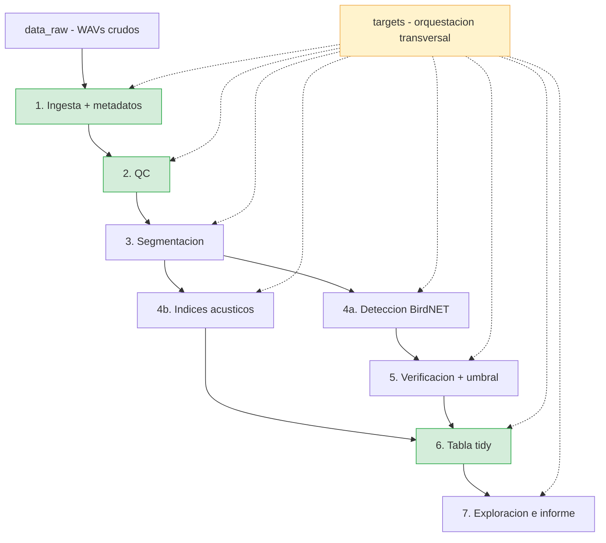

# Integración de herramientas PAM — material para la charla
### De la SD a la tabla · REIE 2026 · Guillermo Fandos

*Documento interno de preparación. No subir al repositorio público.*
*Todos los datos de repos verificados directamente en junio 2026, salvo donde se indica.*

---

## 1. Pipeline canónico de referencia

El campo PAM carece de un estándar unificado. La mayoría de pipelines profesionales cubren 2-4 etapas del flujo completo; prácticamente ninguno las cubre todas. El pipeline canónico que usamos como referencia tiene siete etapas:

1. **Ingesta + metadatos** — localizar archivos, extraer fecha/hora de dos fuentes independientes (nombre + cabecera WAV), vincular a ID de grabador y coordenadas del despliegue.
2. **QC** — marcar archivos truncados, sin fecha, con discrepancias nombre/cabecera o con huecos en el calendario de grabación.
3. **Segmentación** — dividir grabaciones largas en ventanas de análisis (3 s para BirdNET, 60 s para índices).
4. **Detección / Índices** — clasificación de especies (BirdNET y similares) e índices acústicos (ACI, NDSI, H…).
5. **Verificación + umbral** — revisión manual de una muestra, curvas de precisión/recall por especie, fijación de un umbral defensible.
6. **Tabla tidy** — join de resultados + metadatos + diseño de muestreo en una sola tabla lista para modelar.
7. **Exploración / informe** — visualizaciones diel, heatmaps temporales, UMAP de soundscape, informes reproducibles.

---

## 2. Diagrama del pipeline canónico

**Nodos verdes** = etapas completamente cubiertas por `acoustic-workflow-REIE`.
**Nodo amarillo** = `targets` es una capa transversal, no una etapa del pipeline.

### Qué herramienta cubre qué etapa

| Etapa | Herramientas verificadas |
|---|---|
| ① Ingesta + metadatos | **acoustic-workflow-REIE** (nombre + cabecera WAV sin deps externas), SoundADE (regex YAML sobre path), BirdNET-Analyzer (rutas, sin metadata de grabador) |
| ② QC | **acoustic-workflow-REIE** (`qc_flag` + `qc_schedule_gaps`), NSNSDAcoustics (parcial, solo validación de timestamp) |
| ③ Segmentación | BirdNET-Analyzer (interna, 3 s fijo), SoundADE (ventana configurable en YAML) |
| ④a Detección BirdNET | BirdNET-Analyzer, NSNSDAcoustics, SoundADE |
| ④b Índices acústicos | scikit-maad (>50 índices), soundecology (5 clásicos, archivado), SoundADE (ACI/ADI/Hf/Ht/BI…) |
| ⑤ Verificación + umbral | NSNSDAcoustics (`birdnet_verify` + `birdnet_conf_threshold`), BirdNET-Analyzer (extracción de segmentos para Raven/Audacity) |
| ⑥ Tabla tidy | **acoustic-workflow-REIE** (`consolidate` con guardarraíl), NSNSDAcoustics (`birdnet_format` + `birdnet_gather`), SoundADE (Parquet) |
| ⑦ Exploración / informe | echo-dash (dashboard interactivo), NSNSDAcoustics (heatmaps + barcharts), bacpipe (UMAP de embeddings), warbleR (espectrogramas + medidas acústicas) |
| Orquestación transversal | **targets** (DAG, invalidación selectiva, paralelización implícita) |

---

## 3. Tabla comparativa

| Herramienta | Lenguaje | Etapas cubiertas | Licencia | Último commit | Cuándo usarla |
|---|---|---|---|---|---|
| **BirdNET-Analyzer** | Python | SEG · DET · TAB parcial | MIT + CC BY-NC-SA (modelos) | Jun 2026 ✅ | Punto de entrada para detección de aves; siempre necesario en proyectos de clasificación de especies |
| **NSNSDAcoustics** | R | DET · VER · TAB · EXP | MIT | Sep 2025 ✅ | Pipeline BirdNET completo desde RStudio con verificación metodológicamente defensible; **solo Windows** |
| **scikit-maad** | Python | ING parcial · IDX · TAB parcial | BSD-3 | Feb 2025 ✅ | Índices acústicos exhaustivos (>50) y false-color spectrograms; integrar con BirdNET en flujos Python |
| **soundecology** | R | IDX | GPL-3 | Mar 2018 ⚠️ archivado | Solo como referencia bibliográfica de los 5 índices canónicos; no usar en código nuevo |
| **SoundADE** | Python | ING · QC mínimo · SEG · DET · IDX · TAB | GPL-3 | Feb 2026 ✅ | Procesado HPC en Slurm para >1.000 h de audio; alimenta echo-dash |
| **echo-dash** | Python | DET (vis) · IDX (vis) · EXP | Sin licencia ⚠️ | Feb 2026 ✅ | Dashboard interactivo downstream de SoundADE; requiere Parquet preformateado |
| **bacpipe** | Python | DET parcial · EXP | Apache-2.0 | Oct 2025 ✅ | Comparar embeddings de 23 modelos; exploración no supervisada de soundscapes |
| **warbleR** | R | ING · QC parcial · TAB · EXP | GPL-3 | Abr 2026 ✅ | Análisis de estructura de señal, espectrogramas, medidas acústicas en lote; necesita anotaciones previas |
| **targets** | R | orquestación transversal | MIT | May 2026 ✅ | Orquestar cualquier pipeline R con DAG, invalidación selectiva y paralelización implícita |
| **acoustic-workflow-REIE** | R | ING · QC · IDX básico · TAB | Sin licencia ⚠️ | Jun 2026 | Demo pedagógica del flujo completo con targets; punto de partida para proyectos propios |
| **OpenSoundscape** | Python | ING parcial · SEG · DET · TAB | MIT | May 2026 ✅ | Pipeline ML/CNN completo (ResNet/EfficientNet/BirdNET) con reentrenamiento de clasificadores; sin índices acústicos |

*ING=ingesta/metadatos · QC=QC · SEG=segmentación · DET=detección · IDX=índices · VER=verificación/umbral · TAB=tabla tidy · EXP=exploración/informe*

---

## 4. Análisis por herramienta

### BirdNET-Analyzer
**URL:** https://github.com/kahst/BirdNET-Analyzer · 6.512 especies · v2.4.0 (nov 2025) · Cornell Lab + Chemnitz

**Qué hace bien:**
- Detección por defecto a `min_conf=0.25` con parámetros `lat`/`lon`/`week` que filtran especies esperadas via `run_geomodel`, reduciendo falsos positivos sin lista manual.
- Múltiples formatos de salida simultáneos: `rtype=["csv","raven","audacity","kaleidoscope","parquet"]`.
- Extracción de segmentos de 3 s por detección (`birdnet_analyzer segments`, `collection_mode="confidence"|"balanced"|"random"`) para alimentar revisión manual en Raven o Audacity.

**Cosa concreta para mostrar en pantalla:** la firma de `analyze()` en [`birdnet_analyzer/analyze/core.py#L23`](https://github.com/kahst/BirdNET-Analyzer/blob/main/birdnet_analyzer/analyze/core.py#L23) — visible en GitHub, muestra todos los parámetros de decisión del analista (`min_conf`, `lat`, `lon`, `week`, `rtype`, `overlap`).

**Limitación:** no parsea metadatos de AudioMoth ni Song Meter; timestamp y ubicación deben proporcionarse externamente. No hay interfaz de revisión integrada.

---

### NSNSDAcoustics
**URL:** https://github.com/nationalparkservice/NSNSDAcoustics · v1.1.0 "Wood Frog" (sep 2025) · NPS

**Qué hace bien:**
- Pipeline BirdNET completo desde R sin salir de RStudio: `birdnet_analyzer()` → `birdnet_format()` → `birdnet_gather()` → `birdnet_verify()` → `birdnet_conf_threshold()` → `birdnet_heatmap_time()`.
- `birdnet_conf_threshold()` implementa la regresión logística de Wood & Kahl (2024) para fijar un umbral por especie con F1, precisión y recall — el estándar metodológico más defensible publicado para BirdNET.
- `birdnet_heatmap_time()` superpone curvas de amanecer/anochecer calculadas desde lat/lon, convirtiendo un heatmap de detecciones en una figura publicable.

**Cosa concreta para mostrar en pantalla:** la imagen del heatmap temporal con líneas astronómicas en el README: [`images/heatmap-date-time.png`](https://raw.githubusercontent.com/nationalparkservice/NSNSDAcoustics/main/images/heatmap-date-time.png). Lista para una diapositiva.

**Limitación:** solo Windows 10/11 (explícito en el README). No parsea metadatos de AudioMoth ni Song Meter; timezone y locationID se suministran manualmente.

---

### scikit-maad
**URL:** https://github.com/scikit-maad/scikit-maad · v1.5.2 (feb 2025) · BSD-3 · MEE 2021 doi:10.1111/2041-210X.13711

**Qué hace bien:**
- Más de 50 índices alfa en dos funciones: `all_temporal_alpha_indices()` y `all_spectral_alpha_indices()`, que devuelven DataFrames pandas — el catálogo de índices más amplio disponible en código abierto.
- False-color spectrograms combinando tres índices como canales RGB: método de comparación visual rápida de soundscape no disponible en soundecology ni en seewave.
- Tutorial verificado de flujo completo con parseo de fecha desde nombre de archivo y heatmap de 24 h: [plot_extract_alpha_indices.html](https://scikit-maad.github.io/_auto_examples/2_advanced/plot_extract_alpha_indices.html).

**Cosa concreta para mostrar en pantalla:** el tutorial anterior — código ejecutable + heatmap de 24 h en una sola página web.

**Limitación:** no incluye clasificador de especies ni modelos preentrenados. Para identificación de especies debe combinarse con BirdNET u otro clasificador externo.

---

### soundecology
**URL:** https://github.com/rdecamargo/soundecology · archivado jul 2020 · CRAN 1.3.3 (mar 2018) · GPL-3

**Qué hace bien:**
- Implementa los cinco índices canónicos (ACI, ADI, AEI, NDSI, Bioacoustic Index) con referencias explícitas a los artículos fundacionales.
- `multiple_sounds()` procesa directorios en paralelo y escribe CSV directamente.
- Vignette sobre diferencias metodológicas entre su implementación de ACI y la de seewave — relevante para reproducibilidad entre estudios.

**Cosa concreta para mostrar en pantalla:** página CRAN en https://cran.r-project.org/web/packages/soundecology/ — como referencia de los índices clásicos, aunque el paquete no deba usarse para código nuevo.

**Limitación:** archivado y sin mantenimiento desde 2020. No cubre ninguna otra etapa del pipeline. El sustituto natural es scikit-maad o seewave.

---

### SoundADE
**URL:** https://github.com/ecolistening/SoundADE · v1.1.0 (feb 2026) · GPL-3 · DOI: 10.5281/zenodo.18756138

**Qué hace bien:**
- Arquitectura HPC con Singularity + Slurm: `app.def` y scripts en `slurm/` listos para despliegue en clústeres institucionales sin privilegios de root.
- Configuración por YAML con regex de captura nombrada (`cairngorms.yaml`) que extrae modelo de grabador, ID de sitio y timestamp del path del archivo sin tocar el código.
- Integración de covariables solares y meteorológicas (`index_solar`, `index_weather`) para corrección diel — funcionalidad ausente en el resto de pipelines verificados.

**Cosa concreta para mostrar en pantalla:** el DOI de Zenodo https://doi.org/10.5281/zenodo.18756138 — publicación formal con 13 autores, versionado y metadatos citables. Modelo de referencia para publicar software científico.

**Limitación:** no lee la cabecera WAV de AudioMoth ni archivos de log de Song Meter; depende enteramente de regex sobre el path. QC limitado a eliminación de DC offset.

---

### echo-dash
**URL:** https://github.com/ecolistening/echo-dash · v1.0.0 (feb 2026) · licencia no declarada · demo: https://echodash.co.uk

**Qué hace bien:**
- Dashboard Dash desplegado en producción con datos de los proyectos Sounding Out y Cairngorms — puede mostrarse en vivo en una charla sin ejecutar código local (verificar disponibilidad antes; devolvió 502 en la inspección).
- UMAP de soundscape como página central: cada punto es una grabación de 1 min posicionada por similitud acústica, color-coded por sitio o hora del día.
- Índices validados para equivalencia absoluta con paquetes R (`seewave`, `soundecology`), lo que facilita la comparación entre implementaciones.

**Cosa concreta para mostrar en pantalla:** el live demo en https://echodash.co.uk — o, como alternativa segura, las capturas del README si el servidor está caído.

**Limitación:** herramienta de visualización pura, sin ingesta ni QC ni cómputo de índices. Requiere Parquet con esquema específico de SoundADE. La licencia no está declarada.

---

### bacpipe
**URL:** https://github.com/bioacoustic-ai/bacpipe · v1.2.0 (oct 2025) · Apache-2.0 · readthedocs: https://bacpipe.readthedocs.io

**Qué hace bien:**
- 23 modelos de embedding en una sola interfaz (`bacpipe.play()`): BirdNET, Perch, AudioMAE, BEATs, BioLingual, INSECT66, GOOGLE_WHALE… La figura del README muestra un grid 4×4 de UMAPs con puntuación de linear probing por modelo.
- Dashboard interactivo con audio playback dentro de los clusters de UMAP — exploración de errores de clasificación sin código adicional.
- Punto de entrada para bioacústica no supervisada: clustering de grabaciones por similitud sin etiquetas de especie.

**Cosa concreta para mostrar en pantalla:** la figura [`src/normal_overview.png`](https://raw.githubusercontent.com/bioacoustic-ai/bacpipe/main/src/normal_overview.png) — grid 4×4 de UMAPs, cada panel con nombre del modelo y linear probing score. Directamente usable como diapositiva.

**Limitación:** sin QC, sin metadata de grabador, sin tabla de detecciones. Asume audio limpio y segmentado. Perch v2 solo en Linux. No produce tabla de especies compatible con modelos de ocupancia sin post-procesado sustancial.

---

### warbleR
**URL:** https://github.com/maRce10/warbleR · GPL-3 · activo (último commit abr 2026) · MEE 2017 doi:10.1111/2041-210X.12624

**Qué hace bien:**
- Extended Selection Tables: estructura que embebe clips de audio junto a anotaciones en un único objeto R portátil — el formato de intercambio estándar para análisis de señal en R.
- Cuatro paradigmas de medida acústica sobre la misma selection table: parámetros espectrales, cross-correlation, DTW y MFCCs.
- Paralelización integrada (`cores=`) en todas las funciones de procesado en lote.

**Cosa concreta para mostrar en pantalla:** la vignette principal en https://marce10.github.io/warbleR/articles/a_warbleR.html — flujo completo de descarga de Xeno-Canto a medición acústica.

**Limitación:** la detección automática de señales no es su punto fuerte (los autores redirigen a `ohun`). Requiere anotaciones previas o un detector externo para generar las selection tables.

---

### OpenSoundscape
**URL:** https://github.com/kitzeslab/opensoundscape · v0.13.0 (may 2026) · MIT · Kitzes Lab, U. Pittsburgh

**Qué hace bien:**
- Pipeline ML/CNN completo: entrenamiento, fine-tuning e inferencia con ResNet/EfficientNet/VGG via PyTorch, con integración directa de anotaciones de Raven (`BoxedAnnotations.from_raven_files()`).
- BirdNET y Perch2 via `bioacoustics_model_zoo` (mismo laboratorio): `bmz.BirdNET().predict(files)` y `bmz.BirdNET().embed(files)` con una sola línea; permite reentrenar clasificadores custom sobre embeddings de BirdNET.
- `Audio.from_file()` parsea timestamps UTC de AudioMoth via `aru_metadata_parser` (lee el campo Comment del WAV) — feature no trivial para despliegues de campo.

**Cosa concreta para mostrar en pantalla:** el snippet de BirdNET del README en https://github.com/kitzeslab/opensoundscape/blob/master/README.md — muestra en 4 líneas desde predicción hasta reentrenamiento de clasificador.

**Limitación:** sin módulo de índices acústicos (no hay ACI, NDSI, H…). El parsing de AudioMoth se documenta explícitamente como frágil ("likely to break when new firmware versions change the comment field"). Sin soporte para Song Meter.

---

### targets (ropensci)
**URL:** https://github.com/ropensci/targets · MIT · v1.12.0 (feb 2026) · JOSS doi:10.21105/joss.02959 · 1.085 estrellas

**Qué hace bien:**
- **Invalidación selectiva por grafo de dependencias:** cuando cambias la función de umbral de BirdNET, solo se recalcula esa función y todo lo que depende de ella — no las 10 horas de carga de audio. En proyectos de tres temporadas de campo, esto es la diferencia entre 30 segundos y 3 horas.
- **Detección automática de dependencias:** el DAG se infiere por análisis estático del código; no se declaran dependencias a mano. Si `consolidate()` llama a `qc_flag()`, `targets` lo sabe.
- **Paralelización implícita con `crew`:** los targets independientes se distribuyen entre workers sin modificar la definición del pipeline.

**Cosa concreta para mostrar en pantalla:** el `_targets.R` mínimo del walkthrough en https://books.ropensci.org/targets/walkthrough.html, o el vídeo de 4 min en https://vimeo.com/700982360. Para una charla técnica, `tar_visnetwork()` en vivo mostrando el DAG con nodos coloreados según estado.

**Limitación:** curva de aprendizaje inicial — el código debe reestructurarse en funciones puras antes de que `targets` pueda orquestarlo. Es R-only; envolver Python (BirdNET) requiere `system()` o `reticulate`.

---

## 5. Posicionamiento de acoustic-workflow-REIE

### Etapas cubiertas

| Etapa | Estado | Dónde |
|---|---|---|
| Ingesta + metadatos | ✓ completo | `list_audio()`, `parse_metadata()`, `datetime_from_name()`, `read_wav_comment()` — `R/parse_metadata.R` |
| QC | ✓ completo | `qc_flag()`, `qc_schedule_gaps()`, `qc_summary()` — `R/qc.R` |
| Segmentación | ✗ no implementado | Asume archivos ya segmentados |
| Detección BirdNET | ~ stub comentado | `run_birdnet()` y `read_birdnet_out()` en `R/indices.R`, comentados en `_targets.R` |
| Índices acústicos | ~ básico (demo) | `compute_indices_basic()`: RMS + entropía espectral; `compute_indices()` con soundecology, opcional |
| Verificación + umbral | ~ implícito | `tol_frac` del QC; sin threshold por especie de BirdNET |
| Tabla tidy | ✓ completo con guardarraíl | `consolidate()` con detección de inflación de filas — `R/consolidate.R` |
| Exploración / informe | ✗ mínimo | `View(tabla)` en `practica.R`; sin visualizaciones ni informe |

### Qué concepto toma de cada flujo profesional

| Flujo de referencia | Concepto adoptado en acoustic-workflow-REIE |
|---|---|
| BirdNET-Analyzer | `run_birdnet()` via `system2()` — arquitectura de detector externo lanzado desde R, stub listo para descommentar |
| NSNSDAcoustics | Modelo de función por etapa + tabla tidy como output; la cadena `format → gather → verify` inspira el diseño de `consolidate()` |
| scikit-maad | `compute_indices()` está diseñado para ampliarse con maad desde Python via `reticulate`; los 50 índices son el paso natural |
| SoundADE | Filosofía de carpeta-por-grabador como ID: `recorder_id <- basename(dirname(path))` es la misma decisión de diseño |
| targets | DAG completo, invalidación selectiva, `format="file"` para rastrear archivos externos, `tar_option_set(packages=...)` |

### Frases de posicionamiento para la charla

1. **"El campo está fragmentado: ninguna herramienta cubre el pipeline completo."** BirdNET produce detecciones pero no toca los metadatos. scikit-maad calcula 50 índices pero no sabe que el grabador estaba en UTC. soundecology está archivado. `acoustic-workflow-REIE` no es otro detector ni otro calculador de índices: es la arquitectura que los une.

2. **"R + targets es el pegamento que el ecosistema PAM no tiene."** SoundADE tiene un pipeline Python pero sin DAG con invalidación. NSNSDAcoustics corre en R pero sin `targets`. Cambiar el umbral de QC y que `targets` recalcule solo lo necesario — y que el analista pueda auditar exactamente qué cambió y por qué — no lo hace ningún otro flujo verificado aquí.

3. **"El error más silencioso del campo no está en el modelo. Está en el join."** Ninguna herramienta verificada incluye un guardarraíl contra la inflación de filas al unir resultados con el diseño de muestreo. `consolidate()` lo detecta explícitamente. Multiplicado por tres temporadas de campo y tres becarios distintos, eso es la diferencia entre ciencia reproducible y números que no cuadran.

4. **"La validación cruzada de metadatos es el paso que todos se saltan."** SoundADE lee timestamps desde el path del archivo. BirdNET no los lee. scikit-maad tiene un parser básico para Song Meter. Solo `acoustic-workflow-REIE` valida la fecha/hora contra la cabecera interna del WAV sin dependencias externas y emite un warning explícito cuando discrepan.

> **Nota de charla:** `sonicscrewdriver`, el paquete R nativo para parsear AudioMoth (que `parse_metadata.R` usa como plan A), fue retirado de CRAN el 11 de junio de 2026 porque el email del mantenedor dejó de funcionar. El "plan B" de `read_wav_comment()` — leer el chunk ICMT del WAV con R base sin dependencias — no es un workaround provisional: **es la única opción robusta disponible hoy**. Esto es un argumento directo a favor de no depender de un único paquete para una etapa crítica del flujo.

---

## 6. Notas de orador — diapositivas propuestas

### Diapositiva: "El campo está fragmentado"
*(tabla comparativa o diagrama Mermaid)*

- Siete etapas; ninguna herramienta cubre todas. El analista ensambla su propio stack.
- El gap más peligroso es invisible: los metadatos (zona horaria, ID de grabador) no los toca casi nadie.
- `soundecology`, la referencia clásica de índices en R, está archivada desde 2020.
- `SoundADE` + `echo-dash` son el intento más serio de pipeline completo; requieren HPC y producen Parquet, no R.
- La fragmentación no es un fallo del campo: es una oportunidad para quien diseña la capa de integración.
- Pregunta para el público: ¿cuántos de vosotros habéis tenido más filas de las esperadas después de un join y no sabíais por qué?

### Diapositiva: "Por qué targets"
*(DAG de `tar_visnetwork()` o `_targets.R` mínimo)*

- Un script secuencial (`source()`) no sabe qué cambió: recalcula todo o nada.
- `targets` infiere el grafo de dependencias por análisis estático del código — sin declaraciones manuales.
- Cambiar `tol_frac` en `qc_flag()` invalida QC, índices y tabla. No toca los metadatos, que son la etapa más lenta.
- En tres temporadas de campo: diferencia entre 30 s y 3 h de cómputo.
- Un becario que hereda el proyecto ve exactamente qué targets están desactualizados y por qué — sin notas de laboratorio.
- `tar_visnetwork()` muestra el estado del pipeline en un grafo interactivo: verde = actualizado, naranja = a recalcular.

### Diapositiva: "Dónde encaja mi flujo"
*(diagrama de pipeline anotado con colores)*

- `acoustic-workflow-REIE` no compite con BirdNET (detección) ni con scikit-maad (50 índices).
- Cubre las etapas que nadie más cubre bien: ingesta + metadatos con validación cruzada, QC con detección de huecos, tabla tidy con guardarraíl anti-duplicados.
- El stub de BirdNET está listo: descomentar dos líneas en `_targets.R` e integrar detecciones en la tabla final.
- Siguiente paso natural: conectar `scikit-maad` via `reticulate` para los 50 índices; conectar `NSNSDAcoustics` para verificación defensible de BirdNET.
- Este repo es el punto de partida, no el punto de llegada. Lo que enseña es la arquitectura; los motores (BirdNET, maad) se conectan encima.
