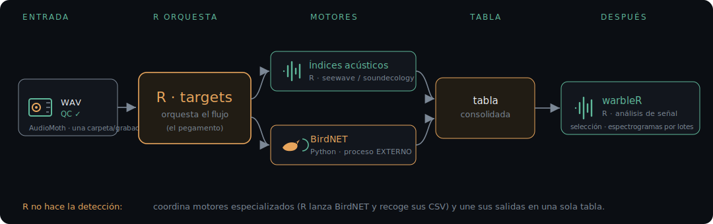
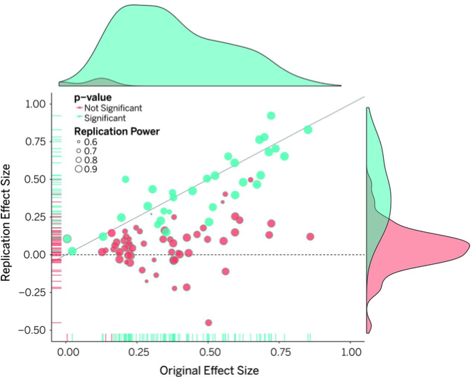
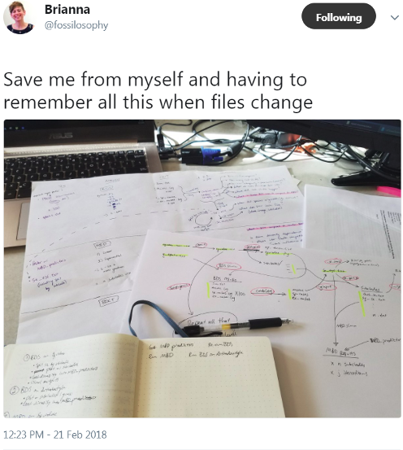
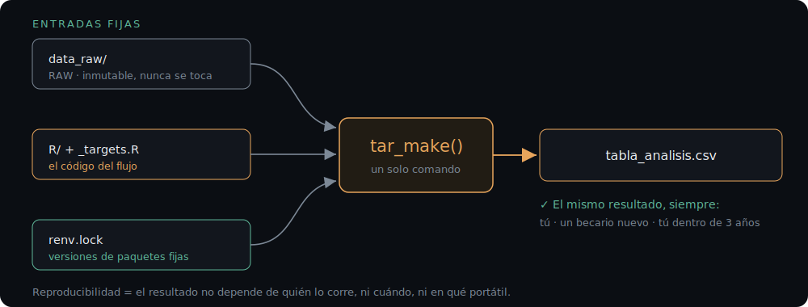
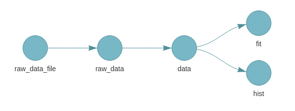
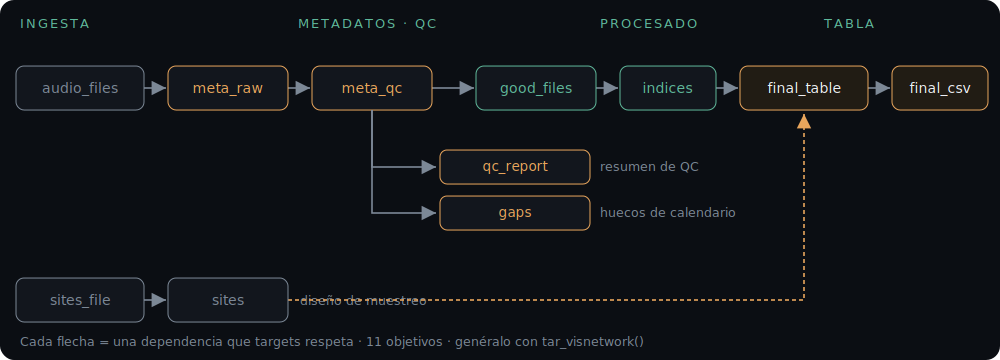
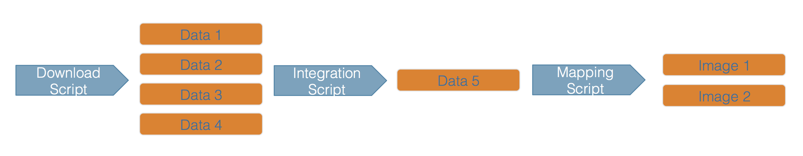
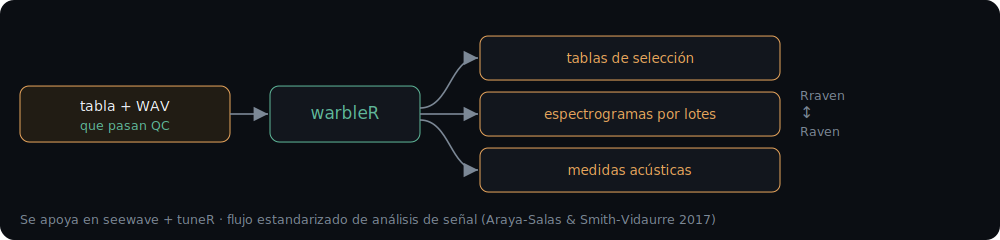

## ¿Te suena esto?

{fig-alt="Tira de PhD Comics: un documento guardado como FINAL.doc acaba en FINAL_rev.22.comments49.corrections.10... tras infinitas revisiones" fig-align="center" width="36%"}

::: notes
A mano alzada: ¿quién tiene un script así? Casi todas las manos. De eso va la charla.
:::

---

## ¿Dónde se va el tiempo de verdad?

<p class="kicker">El problema</p>

<hr class="rule">

::: {.lead}
No en el modelo. <span class="hl">El 80% del esfuerzo</span> está en nombrar,
leer metadatos, organizar y limpiar — <span class="hl">antes</span> de analizar nada.
:::

. . .

::: {.muted .small}
Hoy ordenamos ese caos en un flujo reproducible en R. **Las diapos son para llevar.**
:::

---

## Seguiremos un archivo de principio a fin

<p class="kicker">El mapa · y el hilo de hoy</p>

<div class="pipeline">
  <span class="step">01 Campo</span><span class="step">02 Ingesta</span>
  <span class="step">03 Metadatos·QC</span><span class="step">04 Procesado</span><span class="step">05 Tabla</span>
</div>

<hr class="rule">

::: {.lead}
<span class="hl">AM01/20260501_060000.WAV</span> — lo veremos transformarse
en cada etapa hasta ser una fila lista para modelar.
:::

::: {.muted .small}
El mapa reaparece arriba en cada bloque: siempre sabrás dónde estás.
:::

---

## En vivo: un solo comando

<p class="kicker">Payoff primero</p>

::: {.live}
<span class="lbl">En vivo · demo 1</span>
:::

```bash
git clone https://github.com/guifandos/acoustic-workflow-REIE.git
```
```r
targets::tar_make()      # corre TODO el flujo
```

. . .

…y aparece `output/tabla_analisis.csv`. **Lista para modelar.**

::: {.muted .small}
¿Cómo lo hace ese comando? Al final. Primero, de dónde sale el dato.
:::

---

## El dato nace<br>en el campo {.section-divider}

<span class="section-num">ACTO 1 · UN GUIÑO AL CAMPO</span>

::: notes
Encuadre: la charla va de la SD en adelante, pero en 1 diapo recordamos que la calidad se decide antes.
:::

---

## La reproducibilidad empieza en el micrófono {.takeaway}

<p class="kicker">Etapa 01 · Campo</p>

::: {.lead}
Ningún script arregla un <span class="hl">muestreo mal diseñado</span> ni
metadatos que <span class="hl">no anotaste</span>.
:::

::: {.dual}
::: {.b}
<span class="lbl">Colocación · imprescindible</span>
diseño de muestreo · altura del micro · lejos de ruido constante · calendario según cuándo vocaliza el objetivo
:::
::: {.a}
<span class="lbl">Hoja de despliegue · anota o lo pierdes</span>
ID · sitio · **coordenadas** · nº de SD · foto · ganancia · **deriva del reloj**
:::
:::

::: {.muted .small}
Estandarizar el protocolo es lo que hace los datos comparables. Lo demás ya es código.
:::

---

## De la SD<br>a la tabla {.section-divider}

<span class="section-num">ACTO 2 · EL FLUJO EN R</span>

---

## R orquesta. No lo hace todo.

<p class="kicker">Principio</p>

<hr class="rule">

:::: {.columns}
::: {.column width="50%"}
::: {.panel}
**R** — el pegamento
metadatos · QC · unión · reproducibilidad
:::
:::
::: {.column width="50%"}
::: {.panel}
**Python / CLI** — los motores
BirdNET · Perch · scikit-maad
:::
:::
::::

. . .

::: {.muted .small}
R coordina y construye la tabla. Sin peleas R-vs-Python.
:::

---

## `data_raw/` es intocable

<p class="kicker">Etapa 02 · Ingesta</p>

<div class="pipeline">
  <span class="step done">01 Campo</span><span class="step active">02 Ingesta</span>
  <span class="step">03 Metadatos·QC</span><span class="step">04 Procesado</span><span class="step">05 Tabla</span>
</div>

::: {.ba}
::: {.col .bad}
<span class="h">Antes</span>
audios_2024_FINAL/ · copia_buena/ · sin_orden/ · IMG_312.WAV
:::
::: {.col .good}
<span class="h">Después</span>
data_raw/AM01/ · data_raw/AM02/ · (RAW, solo lectura)
:::
:::

::: {.muted .small}
Regla de oro: no se edita, no se renombra, no se borra. Todo lo demás se deriva de ahí.
:::

<p class="trace"><span class="f">AM01/20260501_060000.WAV</span><span class="arrow">→</span> archivo crudo en disco</p>

---

## Una carpeta por grabador

<p class="kicker">Etapa 02 · Ingesta</p>

AudioMoth **no** guarda el ID del grabador en el nombre (solo la fecha).
Que la **carpeta** sea el identificador:

```r
recorder_id <- basename(dirname(path))   # R/parse_metadata.R
```

::: {.muted .small}
Song Meter sí lo pone en el nombre. Aquí encaja tu NAS: misma estructura en todos los proyectos.
:::

<p class="trace"><span class="f">AM01/20260501_060000.WAV</span><span class="arrow">→</span> <span class="new">recorder_id = AM01</span></p>

---

## Nunca te fíes solo del nombre

<p class="kicker">Etapa 03 · Metadatos</p>

<div class="pipeline">
  <span class="step done">01 Campo</span><span class="step done">02 Ingesta</span>
  <span class="step active">03 Metadatos·QC</span><span class="step">04 Procesado</span><span class="step">05 Tabla</span>
</div>

::: {.dual}
::: {.b}
<span class="lbl">Fuente A · nombre</span>
`seewave::audiomoth()`
hex antiguo y `YYYYMMDD_HHMMSS`
:::
::: {.a}
<span class="lbl">Fuente B · cabecera</span>
`sonicscrewdriver::audiomoth_wave()`
hora, temperatura, batería
:::
:::

::: {.danger .small}
Si A ≠ B → zona horaria, renombrado o deriva de reloj. **Salta el aviso.**
:::

<p class="trace"><span class="f">AM01/…060000.WAV</span><span class="arrow">→</span> recorder_id, <span class="new">datetime = 2026-05-01 06:00</span>, dur = 10s</p>

---

## En vivo: rómpelo a propósito

<p class="kicker">Etapa 03 · Metadatos</p>

::: {.live}
<span class="lbl">En vivo · demo 2</span>
:::

```r
parse_metadata(files, tz = "America/New_York")   # antes: "UTC"
tar_make()
```

Observa el aviso de **discrepancia nombre vs cabecera**.

::: {.muted .small}
Romper algo a propósito enseña más que verlo funcionar. Que lo ejecuten ellos.
:::

---

## El control de calidad que todos se saltan

<p class="kicker">Etapa 03 · QC</p>

::: {.panel}
`qc_flag()`: sin fecha · duración anómala · discrepancias.
`qc_schedule_gaps()`: **huecos** (batería o SD agotada).
:::

```
Archivos: 6   |   Duración anómala: 1 (truncado)   |   PASAN QC: 5/6
```

<p class="trace"><span class="f">AM01/…060000.WAV</span><span class="arrow">→</span> …<span class="arrow">→</span> <span class="new">qc_pass = TRUE</span></p>

---

## Dos caminos, no excluyentes

<p class="kicker">Etapa 04 · Procesado</p>

<div class="pipeline">
  <span class="step done">01 Campo</span><span class="step done">02 Ingesta</span>
  <span class="step done">03 Metadatos·QC</span><span class="step active">04 Procesado</span><span class="step">05 Tabla</span>
</div>

::: {.dual}
::: {.b}
<span class="lbl">Índices acústicos</span>
Resumen del paisaje sonoro
`soundecology` · scikit-maad
:::
::: {.a}
<span class="lbl">Clasificación</span>
Especie a especie
**BirdNET** · Perch
:::
:::

```r
NSNSDAcoustics::birdnet_analyzer(...)   # BirdNET desde R; R solo coordina
```

::: {.danger .small}
BirdNET no es una caja mágica: falsos positivos/negativos y rendimiento variable
por especie y región. Fija un umbral y **verifica una muestra** (Pérez-Granados, *Ibis* 2023).
:::

<p class="trace"><span class="f">AM01/…060000.WAV</span><span class="arrow">→</span> …<span class="arrow">→</span> <span class="new">aci = 0.42 · ndsi = 0.71</span></p>

---

## Cómo se integra: R orquesta

<p class="kicker">Etapa 04 · Procesado</p>

{fig-alt="WAV que pasan QC entran en R/targets, que coordina índices (R) y BirdNET (Python, proceso externo); sus salidas se unen en la tabla; después warbleR toma la tabla para el análisis de señal" fig-align="center" width="94%"}

::: {.muted .small}
Índices en R · **BirdNET** corre como proceso externo de Python (R lo lanza y recoge sus CSV) · **warbleR** toma la tabla después. R es el pegamento.
:::

---

## El `left_join` asesino

<p class="kicker">Etapa 05 · Tabla</p>

<div class="pipeline">
  <span class="step done">01 Campo</span><span class="step done">02 Ingesta</span>
  <span class="step done">03 Metadatos·QC</span><span class="step done">04 Procesado</span><span class="step active">05 Tabla</span>
</div>

::: {.lead .danger}
«¿Por qué tengo 10.000 detecciones si grabé 500 archivos?»
:::

. . .

```r
assert_unique_key(sites, "recorder_id")   # falla ANTES de inflar
```

{fig-alt="Meme de Tyrion: that's what I do, I drink and I join data" fig-align="center" width="58%"}

<p class="trace"><span class="f">AM01/…060000.WAV</span><span class="arrow">→</span> <span class="new">fila completa: + sitio · lat/lon · hábitat</span></p>

---

## La crisis de reproducibilidad

<p class="kicker">Por qué necesitamos flujos reproducibles</p>

{fig-alt="Scatter plot: tamaño del efecto original (eje X) vs. en la replicación (eje Y). La mayoría de resultados significativos (rosa) no replican o se reducen; los verdes sí replican" fig-align="center" width="62%"}

::: {.muted .small}
Open Science Collaboration (2015, *Science*): solo el 36 % de 100 estudios replicaron. El problema no empieza en el modelo — empieza en el flujo de datos.
:::

---

## «Sálvame de mí mismo»

<p class="kicker">El dolor real de los scripts sin pipeline</p>

:::: {.columns}
::: {.column width="50%"}
{fig-alt="Tweet de Brianna @RossKosophy: Save me from myself and having to remember all this when files change, con foto de notas de dependencias escritas a mano en un cuaderno" fig-align="center" width="90%"}
:::
::: {.column width="50%"}
::: {.lead}
¿Cuántas veces has perdido el hilo de <span class="hl">qué hay que volver a correr</span> cuando cambia un dato o un parámetro?
:::
::: {.muted .small .fragment}
Con 6 archivos de demo ya ocurre. Con 3 temporadas de campo, te consume semanas.
:::
:::
::::

---

## El análisis de datos como Sísifo

<p class="kicker">Scripts secuenciales = subir la roca cada vez</p>

:::: {.columns}
::: {.column width="42%"}
{fig-alt="Sísifo cargando eternamente una piedra enorme cuesta arriba, condenado a repetirlo sin fin" fig-align="center" width="90%"}
:::
::: {.column width="58%"}
::: {.incremental}
- Cambias el **umbral de QC** → ¿qué scripts hay que volver a correr?
- Llega un **becario nuevo** → ¿en qué orden se ejecuta todo?
- **Revisión del paper** → ¿de dónde sale exactamente esa tabla?
- **Tres temporadas de campo** → ¿qué versión del código la generó?
:::
::: {.muted .small .fragment}
La solución no es recordar mejor. Es **no tener que recordar**.
:::
:::
::::

::: {.muted .small}
*François, Tumba de Carlo Ruspi (1825)*
:::

---

## `targets` {.section-divider}

<span class="section-num">ACTO 3 · EL PEGAMENTO</span>

---

## Por qué importa la reproducibilidad

{fig-alt="Tres entradas fijas (data_raw inmutable, código R/_targets.R, renv.lock con versiones) pasan por un solo comando tar_make() y producen siempre la misma tabla: el resultado no depende de quién la corre, ni cuándo, ni en qué portátil" fig-align="center" width="82%"}

---

## ¿Qué hace `targets`?

<p class="kicker">Reproducibilidad</p>

<hr class="rule">

::: {.incremental}
- **Recalcula solo lo que cambió** — editas el QC, reusa el parseo de caché.
- **Garantiza el orden** — no consolida antes de parsear.
- **Hace visible el flujo** — `tar_visnetwork()` lo dibuja.
:::

. . .

::: {.panel}
**Regla mental:** una función = un paso = un `tar_target()`. No reescribes: envuelves.
:::

---

## De scripts a funciones

<p class="kicker">targets · el primer paso</p>

::: {.panel}
**Regla de oro:** una función = un paso = un `tar_target()`. No reescribes el script: lo **envuelves**.
:::

<hr class="rule">

:::: {.columns}
::: {.column width="49%"}
```r
# ❌ Script monolítico (200 líneas)
raw  <- read.csv("data_raw/AM01/...")
meta <- parse_all(raw)
meta$qc <- flag_qc(meta)
idx  <- compute(meta)
tab  <- join(idx, sites)
write.csv(tab, "output/tabla.csv")
```
:::
::: {.column width="49%"}
```r
# ✓ Una función, un fichero
# R/parse_metadata.R
parse_metadata <- function(files, tz) {
  do.call(rbind,
    lapply(files, parse_one, tz = tz))
}
```
:::
::::

---

## La anatomía de un `tar_target()`

<p class="kicker">targets · bloques fundamentales</p>

```r
tar_target(
  name    = meta_raw,              # ← el nodo en el grafo
  command = parse_metadata(        # ← la función que lo produce
              audio_files,         # ← otro target: crea una flecha
              tz = recorder_tz     # ← parámetro escalar: no crea flecha
            )
)
```

::: {.incremental}
- **`name`** → el objeto en caché; recupéralo con `tar_read(meta_raw)` o `tar_load(meta_raw)`
- **`command`** → cualquier expresión R que devuelva algo serializable
- Los argumentos que son **otros targets** definen las flechas del DAG automáticamente
:::

---

## Un DAG mínimo

<p class="kicker">targets · el ejemplo didáctico</p>

{fig-alt="Grafo de dependencias del ejemplo airquality: raw_data_file apunta a raw_data que apunta a data; data se bifurca en fit y en hist" fig-align="center" width="65%"}

```r
list(
  tar_target(raw_data_file, "data/airquality.csv", format = "file"),
  tar_target(raw_data,  read.csv(raw_data_file)),
  tar_target(data,      dplyr::filter(raw_data, !is.na(Ozone))),
  tar_target(hist,      hist(data$Ozone)),
  tar_target(fit,       lm(Ozone ~ Wind + Temp, data = data))
)
```

::: {.muted .small}
`targets` lee el código estáticamente e infiere el grafo. Sin declaración manual de dependencias.
:::

---

## El grafo del pipeline

<p class="kicker">Reproducibilidad</p>

{fig-alt="Grafo de dependencias del pipeline: audio_files → meta_raw → meta_qc → good_files → indices → final_table → final_csv; meta_qc también alimenta qc_report y gaps; sites_file → sites se une en final_table" fig-align="center" width="90%"}

::: {.muted .small}
11 objetivos; cada flecha es una dependencia que `targets` conoce y respeta.
Genera el tuyo con `tar_visnetwork()` (interactivo) o `tar_mermaid()`.
:::

---

## El ciclo de trabajo con targets

<p class="kicker">targets · flujo iterativo</p>

{fig-alt="Ciclo continuo de seis pasos: escribir función en R/, añadir tar_target en _targets.R, visualizar con tar_visnetwork(), ejecutar con tar_make(), comprobar resultados, volver a escribir función" fig-align="center" width="92%"}

::: {.muted .small}
Fuente: rdatatoolbox.github.io/course-targets (CC-BY 4.0)
:::

---

## En vivo: la magia de la caché

<p class="kicker">Reproducibilidad</p>

::: {.live}
<span class="lbl">En vivo · demo 3</span>
:::

```r
# edita un umbral en R/qc.R, guarda, y:
targets::tar_make()
```

Solo recalcula **QC y lo de aguas abajo**. El parseo ni se toca.

::: {.muted .small}
En tres temporadas de campo, esto es la diferencia entre 30 s y 3 h.
:::

---

## warbleR: de la tabla al análisis de señal

<p class="kicker">Y ahora qué</p>

::: {.lead}
Tu tabla y los archivos que pasan QC son <span class="hl">la entrada de warbleR</span>.
:::

{fig-alt="Workflow de warbleR: tabla y WAV que pasan QC entran en warbleR y producen tablas de selección, espectrogramas por lotes y medidas acústicas; Rraven conecta con Raven" fig-align="center" width="86%"}

::: {.muted .small}
Flujo estandarizado de análisis de estructura de señal (Araya-Salas & Smith-Vidaurre, *MEE* 2017).
:::

---

## Construye tu pipeline {.section-divider}

<span class="section-num">ACTO 4 · INTEGRACIÓN</span>

---

## El ecosistema PAM: fragmentado por diseño

<p class="kicker">Integración</p>

<hr class="rule">

::: {.lead}
Ninguna herramienta cubre las <span class="hl">7 etapas</span> del flujo completo.<br>
La pregunta no es «¿qué herramienta uso?» sino «<span class="hl">¿qué arquitectura las une?</span>»
:::

. . .

::: {.small}
| Herramienta | Fortaleza | Estado |
|---|---|---|
| BirdNET-Analyzer | detección de especies (>9000 spp) | activo · MIT |
| scikit-maad | >50 índices acústicos | activo · BSD-3 |
| warbleR | estructura de señal, selección manual | activo · GPL-2 |
| NSNSDAcoustics | wrapper BirdNET + tabla R | activo · MIT |
| soundecology | índices clásicos (ACI, ADI…) | archivado 2020 |
| **acoustic-workflow-REIE** | **QC · orquestación · tabla** | **este repo** |
:::

---

## Conectar BirdNET al pipeline

<p class="kicker">Integración · detección de especies</p>

El stub ya está en `R/indices.R`. Solo hay que descomentar dos líneas en `_targets.R`:

```r
# En _targets.R — ya escrito, descomentar:
tar_target(birdnet_csv,
           run_birdnet(audio_dir, out_dir = "output/birdnet")),
tar_target(detections,
           read_birdnet_out(birdnet_csv)),
```

```r
# R/indices.R — run_birdnet() llama al CLI de BirdNET via system2()
args <- c("-m", "birdnet_analyzer.analyze",
          "--i", audio_dir, "--o", out_dir,
          "--min_conf", "0.25", "--rtype", "csv")
system2("python", args)
```

::: {.muted .small}
`targets` rastrea `birdnet_csv` como fichero (`format = "file"`): si BirdNET produce nuevos CSV, solo recalcula `detections` y `final_table`, no las 10 h de audio.
:::

---

## Más índices: scikit-maad desde R

<p class="kicker">Integración · índices acústicos</p>

`scikit-maad` tiene >50 índices y false-color spectrograms. Acceso desde R con `reticulate`:

```r
# R/indices_maad.R
compute_indices_maad <- function(files) {
  maad <- reticulate::import("maad")
  rows <- lapply(files, function(f) {
    s   <- maad$sound$load(f)
    idx <- maad$features$all_spectral_alpha_indices(s[[1]], s[[2]])
    cbind(file = f, as.data.frame(idx))
  })
  do.call(rbind, rows)
}
```

```r
# En _targets.R — sustituir compute_indices_basic():
tar_target(indices, compute_indices_maad(good_files))
```

::: {.muted .small}
`reticulate` gestiona el entorno Python. Una vez instalado (`pip install scikit-maad`), el resto es R puro.
:::

---

## El pipeline que puedes tener

<p class="kicker">Integración · visión completa</p>

{fig-alt="WAV pasan QC en R/targets; los archivos OK entran en scikit-maad para índices y en BirdNET para detecciones; ambas salidas se unen en la tabla R; warbleR toma tabla + WAV para análisis de señal; echo-dash visualiza" fig-align="center" width="96%"}

::: {.muted .small}
Todos los motores (BirdNET, scikit-maad, warbleR) se conectan al mismo orquestador de `targets`. Cambias uno sin tocar los demás.
:::

---

## Chuletas e integración {.section-divider}

<span class="section-num">PARA LLEVAR</span>

---

## El flujo entero en una pantalla {.takeaway}

::: {.cheat}
<span class="st">01 Campo</span><span class="do">protocolo + hoja de despliegue (coordenadas, SD, foto, deriva de reloj)</span>
<span class="row-line"></span>
<span class="st">02 Ingesta</span><span class="do"><code>data_raw/</code> intocable · una carpeta por grabador</span>
<span class="row-line"></span>
<span class="st">03 Metadatos</span><span class="do"><code>parse_metadata()</code> · valida nombre vs cabecera</span>
<span class="row-line"></span>
<span class="st">03 QC</span><span class="do"><code>qc_flag()</code> · <code>qc_schedule_gaps()</code></span>
<span class="row-line"></span>
<span class="st">04 Procesado</span><span class="do"><code>compute_indices()</code> · <code>NSNSDAcoustics::birdnet_analyzer()</code></span>
<span class="row-line"></span>
<span class="st">05 Tabla</span><span class="do"><code>consolidate()</code> + <code>assert_unique_key()</code></span>
<span class="row-line"></span>
<span class="st">Pegamento</span><span class="do"><code>targets::tar_make()</code> · <code>renv</code></span>
:::

---

## El flujo mínimo viable

<p class="kicker">Para llevar</p>

<hr class="rule">

::: {.incremental}
1. **El dato nace en campo:** protocolo + hoja de despliegue.
2. **`data_raw/` intocable** y una carpeta por grabador.
3. **Valida metadatos** y **envuelve todo en `targets`**.
:::

. . .

::: {.lead}
El resto es intercambiable. <span class="hl">El esqueleto, no.</span>
:::

---

## Cómo integrarlo en TU proyecto {.takeaway}

<p class="kicker">Para llevar</p>

::: {.incremental}
- **Clona el repo** y borra `data_raw/`; pon tus carpetas por grabador.
- Ajusta `data/sites.csv` con tus coordenadas y `_targets.R` con tu zona horaria y duración.
- Sustituye `compute_indices_basic()` por tus índices reales o por BirdNET.
- `tar_make()` y a iterar. El esqueleto ya está montado.
:::

---

## Referencias y lecturas {.takeaway}

<p class="kicker">Referencias</p>

::: {.small}
**Buenas prácticas de campo (protocolo, hoja de despliegue, deriva de reloj)**
Metcalf et al. (2023) *Good practice guidelines for long-term ecoacoustic monitoring in the UK* (MMU) · protocolos ARU (ABMI) · deriva de reloj: NOAA NCEI, *Passive Acoustic Data*

**BirdNET — uso crítico**
Pérez-Granados (2023, *Ibis*): aplicaciones y *pitfalls* · Thompson et al. (2025, *Ibis*): post-procesado · dataset urbano de Gotemburgo (*Scientific Data* 2025, `doi:10.1038/s41597-025-05481-z`)

**Análisis de señal en R**
Araya-Salas & Smith-Vidaurre (2017, *Methods Ecol. Evol.*): warbleR — `doi:10.1111/2041-210X.12624` · Sueur, Aubin & Simonis (2008, *Bioacoustics*): seewave — `doi:10.1080/09524622.2008.9753600`

**Crisis de reproducibilidad**
Open Science Collaboration (2015, *Science*): Estimating the reproducibility of psychological science — `doi:10.1126/science.aac4716`

**Reproducibilidad y herramientas**
Landau (2021, *JOSS*): targets — `doi:10.21105/joss.02959` · Curso rdatatoolbox.github.io/course-targets (CC-BY 4.0) · `scikit-maad` (Ulloa et al. 2021, *Methods Ecol. Evol.*) · `soundecology` · `NSNSDAcoustics` (enlaces en `docs/recursos.md`)

**Imágenes**
Sísifo: François, *Tomb of Carlo Ruspi* (1825), dominio público · tweet: @BrianaRossiology · effect-size: Open Science Collaboration 2015 · workflow cycle: rdatatoolbox CC-BY 4.0
:::

---

## Llévate el repositorio

<p class="kicker">Recursos</p>

:::: {.columns}
::: {.column width="62%"}
- **Repo:** `github.com/guifandos/acoustic-workflow-REIE`
- warbleR · Rraven · ohun — análisis de señal
- NSNSDAcoustics — BirdNET desde R
- sonicscrewdriver — metadatos AudioMoth
- soundecology / scikit-maad — índices
- targets + renv — reproducibilidad

Todo en `docs/recursos.md`.
:::
::: {.column width="38%"}
{fig-alt="Código QR al repositorio github.com/guifandos/acoustic-workflow-REIE" fig-align="center" width="80%"}
:::
::::

. . .

::: {.lead}
Gracias.
:::
